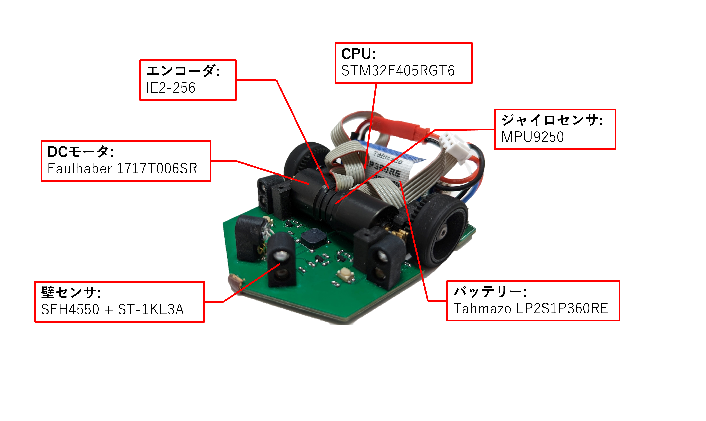
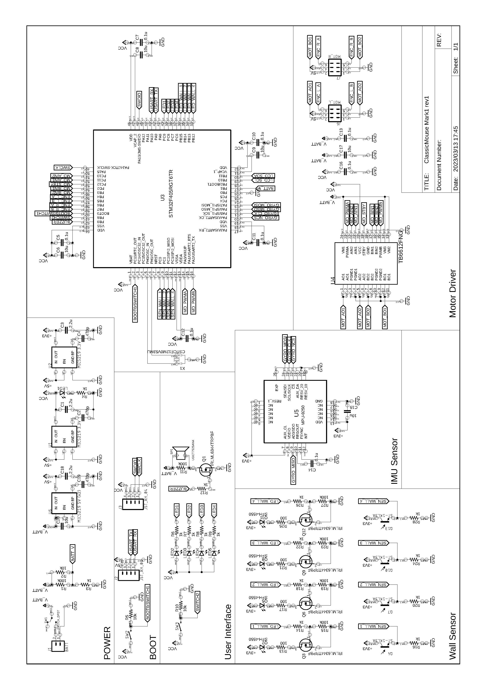

# TRIDENT - Classic size micromouse
Trident is a robotic project to compete in [classic size micromouse](https://www.ntf.or.jp/). 

## Circuit

## Specification
||| 
|---|---|
|Size(W x L x H)| 70 x 84 x 30mm |
|Weight|About 100g|
|CPU|STM32F405RGT6|
|Battery|Tahmazo LP2S1P360RE|
|Motor|Faulhaber 1717T006SR|
|Encoder|IE2-256|
|Motor driver|TB6612FNG|
|Pinion|M0.5 9T Brass|
|Spur Gear|M0.5 42T PA12 MJF|
|Tire|Kyosho high grip tire|
|Gyro rensor|MPU9250|
|Wall sensor LED|SFH4500|
|Wall sensor Phototransistor| ST-1KL3A|

## Environment 
* IDE : STM32 Cube IDE
* EDA : Autodesk Eagle
* CAD : Autodesk Fusion

## Joined micromouse competition
|Date|Competition|Best time|Rank|
|---|---|---|---|
|2023/02/19|第43回全日本マイクロマウス大会|0:18.822|7|
|2023/09/24|第４０回マイクロマウス北陸信越地区大会|0:11.231|5|
|2023/11/12|第３９回マイクロマウス東日本地区大会|0:10.233|8|
|2023/12/09|第３７回全日本学生マイクロマウス大会|0:08.502|8|
|2023/02/18|第44回全日本マイクロマウス大会|0:09.356|14|

